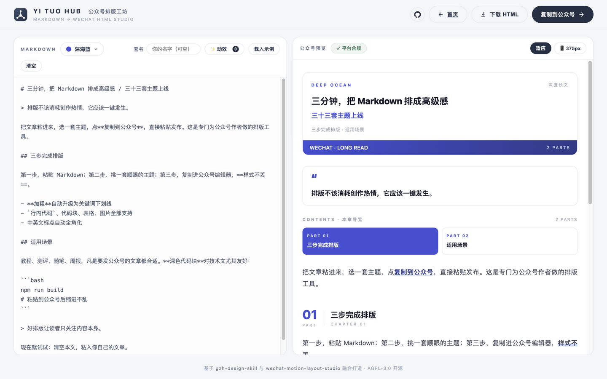
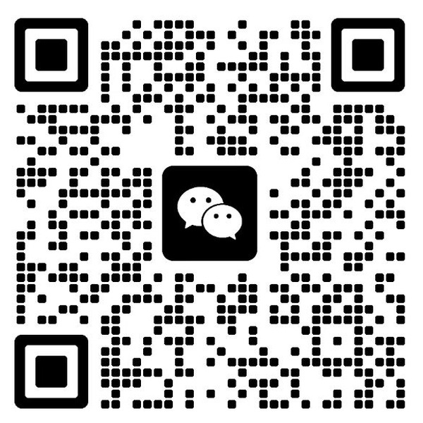

# Yi Tuo Hub · 公众号排版工坊

**粘贴 Markdown，一键排成可直接粘贴到微信公众号编辑器的精致 HTML。** 33 套编辑部级主题、平台合规校验、一键富文本复制——让排版一键发生，把时间还给写作。


## 为什么做这个

公众号作者每天在做两件重复的事：写文章，和跟编辑器搏斗。市面上大多数排版工具给你一堆花哨样式，粘贴过去不是掉样式就是满屏广告。

**Yi Tuo Hub** 是一个纯静态、零依赖、开源的排版工坊：

- **33 套主题，四种气质**——从杂志编辑部到动效风格，总有一套配你的文章
- **粘贴不掉样式**——产物全部内联样式 + `<span leaf>` 包裹，严守公众号编辑器红线，内置合规校验器实时兜底
- **确定性智能**——每段第一个加粗自动升级为主题色关键词下划线、`==高亮==`/`++下划线==` 扩展语法、章节自动编号 + 英文标签、引言卡、导读目录、签名区自动合并、中英标点全角化
- **一键复制**——富文本直接进剪贴板，公众号编辑器 ⌘V 即达
- **动效组件库**——75 个 SMIL 动画 SVG（15 套风格 × 主标题/章节标题/装饰/边框/尾饰），工坊内预览、一键插入封面下方或复制 SVG，公众号原生支持
- **零构建零后端**——纯静态文件，任何一台 nginx 都能跑



## 主题库（33 套 · 4 组）

| 分组 | 主题 |
|------|------|
| **杂志编辑部**（原创） | 深海蓝 · 曙光橙 · 星穹紫 · 鎏金黑 · 青瓷 · 绯樱 |
| **经典复刻**（致敬 gzh-design-skill） | 摸鱼绿 · 红白风 · 石墨极简 · 留白禅意 · 摸鱼票据 · 橄榄手记 |
| **新锐系列** | 摩卡 · 勃艮第 · 午夜靛蓝 · 芒果琥珀 · 湖水青 · 燕麦拿铁 |
| **动效系列**（风格复刻自 [wechat-motion-layout-studio](https://github.com/lanmengSakura/wechat-motion-layout-studio)） | 档案棕褐 · 工程蓝图 · 植物笔记 · 青柠报告 · 珊瑚志 · 深海终端 · 朱砂编辑部 · 雾感研究 · 素金手记 · 新粗野 · 夜航评论 · 宣纸 · 软陶 · 瑞士信号 · 紫罗兰工作室 |

## 快速开始

```bash
git clone https://github.com/yan9651688/yituo-hub.git
cd yituo-hub
python3 -m http.server 8123
# 打开 http://localhost:8123
```

- `/` —— 电影感首页
- `/studio.html` —— 排版工坊（粘贴 → 选主题 → 复制到公众号）

### 服务器部署

```bash
./deploy.sh root@你的服务器IP          # rsync + nginx reload
# 或
docker build -t yituo-hub . && docker run -d -p 80:80 yituo-hub
```

### 输入语法速览

```markdown
# 标题 / 副标题        ← 自动生成杂志封面（双色标题）
## 章节标题            ← 自动编号 + 英文标签
**加粗**               ← 自动升级为主题色关键词下划线
==高亮==  ++下划线++    ← 荧光笔 / 主题下划线
> 引用                 ← 文首转引言卡
```bash … ```           ← macOS 红绿灯代码块
```

## 项目结构

```
├── index.html        电影感首页（雪山云雾 + 鼠标视差）
├── studio.html       排版工坊
├── themes.js         参数化主题引擎（33 套 spec，加主题=加对象）
├── converter.js      Markdown → 语义 token
├── validator.js      公众号平台红线校验
├── app.js            工坊前端逻辑
└── deploy.sh / Dockerfile / nginx.conf
```

## 致谢

- [gzh-design-skill](https://github.com/isjiamu/gzh-design-skill)（AGPL-3.0，甲木 × 摸鱼小李）——本项目的排版工作流、平台红线与"经典复刻"组主题的配色来源
- [wechat-motion-layout-studio](https://github.com/lanmengSakura/wechat-motion-layout-studio)（蓝梦）——"动效系列"15 套主题与 75 个动效 SVG 组件库（`motion/`）来自该项目，**已获作者授权**

## 作者

| | |
|---|---|
| **颜** |  |
| **蓝梦**（[lanmengSakura](https://github.com/lanmengSakura)） |  |

欢迎扫码交流公众号排版与 AI 写作工作流。

## License

[AGPL-3.0](LICENSE)。基于 gzh-design-skill 二次开发，修改与分发须遵循同一协议并保留原项目署名。
